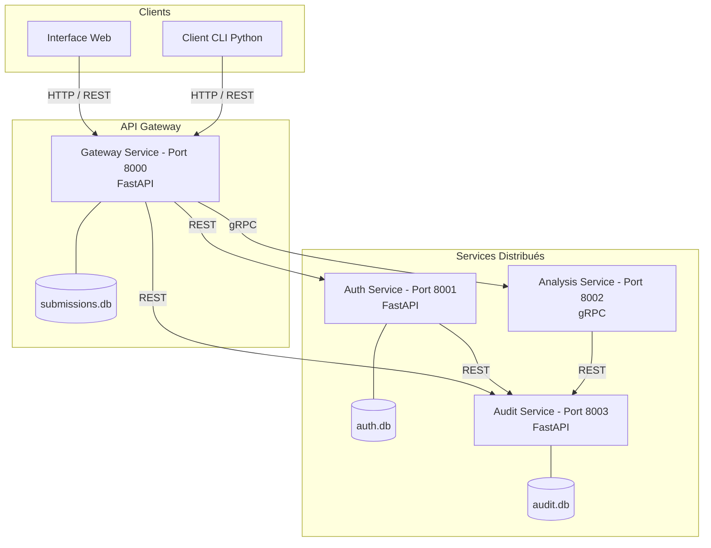
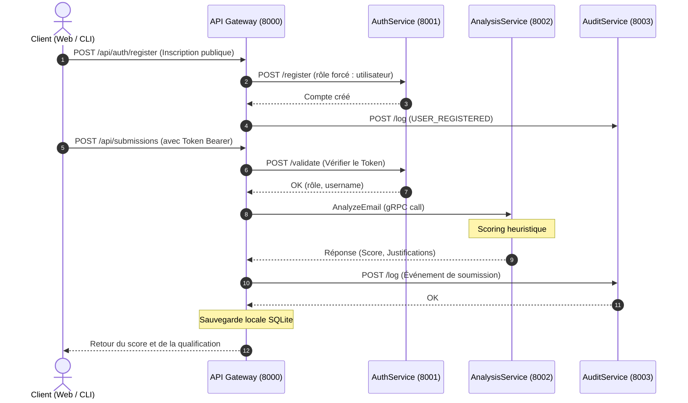

# Rapport de Projet : Plateforme Distribuée PhishShield

**Module : Applications réparties et cybersécurité**  
**Projet de fin de semestre**

---

## 1. Introduction & Objectifs

Le projet **PhishShield** est une plateforme distribuée de qualification et de détection d'e-mails de phishing. Son but est d'offrir une infrastructure robuste, modulaire et hautement sécurisée pour recevoir, inspecter et classifier des signalements suspects.

### Objectifs atteints :
- Conception d'une architecture orientée microservices (communication distribuée).
- Intégration de mécanismes de sécurité avancés (hachage, signature de tokens, contrôle d'accès basé sur les rôles).
- Conception de mécanismes de résilience (disjoncteurs, limites de débit, repli local en mode dégradé).
- Création d'une interface web interactive (UI Premium) avec des modales scrollables et d'un client en ligne de commande (CLI).
- Gestion autonome des comptes utilisateurs avec auto-inscription sécurisée depuis la Web UI et le CLI.
- **Seconde vérification** : Fonctionnalité permettant aux analystes d'émettre un jugement manuel (Phishing Confirmé / Faux Positif) sur les signalements automatisés.

---

## 2. Architecture Technique et Flux d'Information

Le système est composé de 4 microservices et de clients (CLI/Web). Chaque composant s'exécute dans son propre espace de processus.

### Diagramme d'Architecture (Composants)

### Flux d'information typique (Séquence)

### Détail des Protocoles et Ports :
- **API Gateway (Port 8000)** : Point d'accès REST principal gérant le routage, le stockage local des signalements (SQLite `submissions.db`) et servant l'interface utilisateur web.
- **AuthService (Port 8001)** : Gère les accès via HTTP REST. Il isole les identifiants utilisateurs dans `auth.db`.
- **AnalysisService (Port 8002)** : Utilise **gRPC** pour l'échange de messages rapides et typés. Il analyse l'e-mail selon des règles d'ingénierie sociale et d'heuristiques réseaux.
- **AuditService (Port 8003)** : Centralise les logs de sécurité au format JSON via des requêtes HTTP.

---

## 3. Gestion des Rôles, Auto-inscription et Seconde Vérification

La plateforme implémente un système RBAC (Role-Based Access Control) à **trois niveaux** :

| Rôle | Création | Capacités |
| :--- | :--- | :--- |
| `utilisateur` | Auto-inscription (Web UI ou CLI) | Soumettre et consulter les signalements |
| `analyste` | Créé par un administrateur | Mêmes droits que `utilisateur` |
| `administrateur` | Pré-configuré au démarrage (`admin`) | Accès complet + Journaux d'audit |

### Endpoint d'auto-inscription
- **Route** : `POST /api/auth/register` (public, sans authentification)
- **Validation** : Pydantic enforce un nom d'utilisateur de 3+ caractères et un mot de passe de 6+ caractères.
- **Rôle forcé** : Le rôle est systématiquement fixé à `utilisateur` dans le code de la Gateway. Il est impossible pour un utilisateur d'auto-s'inscrire avec un rôle élevé.
- **Accès** : Disponible depuis la **Web UI** (lien "Créer un compte" sur la page de connexion) et depuis le **CLI** (menu d'accueil, option 2).

### Processus de Seconde Vérification (Jugement Manuel)
Afin d'ajouter une couche humaine à la détection automatisée, les utilisateurs ayant le rôle `analyste` ou `administrateur` disposent d'une fonctionnalité exclusive :
- Lors de l'inspection d'un signalement, l'analyste peut émettre un **jugement manuel** (*Phishing Confirmé* ou *Faux Positif*).
- Ce jugement est stocké de manière persistante (colonne `manual_judgement` dans `submissions.db`) et remplace visuellement le statut "En attente de vérification" pour l'utilisateur normal ayant soumis l'e-mail.
- L'émission d'un jugement est strictement contrôlée côté backend et trace un log d'audit spécifique (`MANUAL_JUDGEMENT_ADDED`).

---

## 4. Modélisation des Menaces et Contre-mesures (STRIDE)

Pour répondre aux exigences de cybersécurité par design, nous avons rédigé la matrice des menaces suivantes selon le modèle STRIDE :

| Catégorie | Menace Identifiée | Impact | Contre-mesures appliquées |
| :--- | :--- | :--- | :--- |
| **Spoofing** (Usurpation) | Un attaquant tente d'usurper l'identité d'un analyste ou d'un administrateur. | Accès non autorisé aux signalements et aux logs de sécurité. | Authentification par jeton HMAC-SHA256 signé cryptographiquement avec clé secrète serveur. |
| **Tampering** (Altération) | Modification des requêtes de soumission ou injection de payloads malveillants. | Corruption de la base de données ou contournement de l'analyse. | Validation stricte des types et longueurs via **Pydantic** côté serveur. Limitation de la taille des e-mails à 10 Ko. |
| **Repudiation** (Répudiation) | Un utilisateur effectue des actions sensibles (ex. consultation de logs d'audit) et le nie. | Perte de traçabilité lors d'un incident de sécurité. | **AuditService** dédié et indépendant qui logue systématiquement toutes les actions sensibles avec horodatage et ID utilisateur. |
| **Information Disclosure** (Fuite d'info) | Fuite d'informations d'erreur internes (stack traces) au client ou interception de mots de passe. | Un attaquant peut comprendre l'architecture interne ou intercepter des mots de passe. | Hachage sécurisé `PBKDF2-HMAC-SHA256` avec sel unique. Messages d'erreur génériques renvoyés par l'API Gateway. Mots de passe et tokens complets masqués des logs. |
| **Denial of Service** (Déni de Service) | Brute-force ou inondation du serveur de soumission par des requêtes en boucle. | Épuisement des ressources système et indisponibilité. | Middleware de **Rate Limiting** par adresse IP (fenêtre glissante in-memory). |
| **Elevation of Privilege** (Élévation de privilèges) | Un utilisateur tente de s'auto-inscrire avec le rôle `administrateur` ou `analyste`, ou d'appeler l'API d'audit. | Accès non autorisé aux journaux d'audit ou aux fonctions d'administration. | Le rôle est **forcé à `utilisateur`** dans l'endpoint public `/api/auth/register`. Contrôle de rôle strict (RBAC) sur les routes sensibles : rejet immédiat et log d'alerte critique. |

---

## 5. Résilience et Tolérance aux Pannes

### 1. Circuit Breaker (Disjoncteur)
Les communications avec `AuthService` et `AnalysisService` sont enveloppées dans des objets `CircuitBreaker`. Si un nombre de pannes consécutives (3 par défaut) est atteint, le disjoncteur passe à l'état **OPEN**. Les requêtes futures échouent instantanément pour éviter de monopoliser les threads réseau (fail-fast). Après 10 secondes, il tente une reconnexion (HALF-OPEN).

### 2. Moteur de Secours (Fallback)
Si l'**AnalysisService** gRPC est inaccessible, la Gateway ne renvoie pas d'erreur au client. Elle bascule automatiquement sur un **moteur heuristique local** (Fallback). L'utilisateur reçoit son score de risque avec la mention `[FALLBACK]`, assurant la continuité d'activité de la plateforme.

---

## 6. Guide de Démonstration

Pour valider le fonctionnement de la plateforme en soutenance :
1. **Démarrage global** : `python run_all.py` (vérifier que les 4 services s'initialisent correctement).
2. **Peuplement de test** : Lancer `python demo_submissions.py` pour simuler des signalements variés.
3. **Accès Web** :
   - Naviguer sur `http://127.0.0.1:8000`.
   - Créer un nouveau compte via le lien **"Créer un compte"** sur la page de connexion.
   - Se connecter avec le nouveau compte et soumettre un e-mail suspect.
   - Constater le statut "En attente de vérification manuelle...".
   - Se déconnecter, puis se connecter en tant que `analyst` (`analyst123`).
   - Inspecter le signalement, scroller vers le bas (UI améliorée) et cliquer sur **Phishing Confirmé** ou **Faux Positif**.
   - Se déconnecter puis se connecter en tant que `admin` (`admin123`) pour accéder à l'onglet **Journaux d'audit** et vérifier que l'inscription et le jugement manuel ont bien été tracés.
4. **Test de Résilience** :
   - Stopper le script `app/analysis/main.py` (gRPC).
   - Soumettre un e-mail suspect depuis le navigateur.
   - Observer que l'analyse réussit toujours grâce au message `[FALLBACK]` et que le disjoncteur a détecté la coupure.
