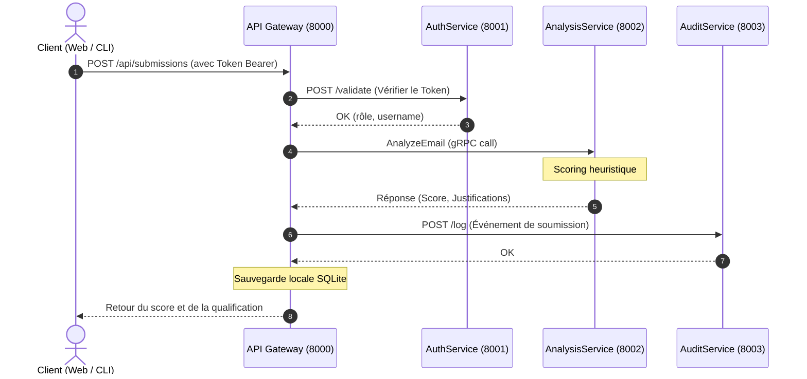

# Rapport de Projet : Plateforme Distribuée PhishShield

**Module : Applications réparties et cybersécurité**  
**Projet de fin de semestre**

---

## 1. Introduction & Objectifs

Le projet **PhishShield** est une plateforme distribuée de qualification et de détection d'e-mails de phishing. Son but est d'offrir une infrastructure robuste, modulaire et hautement sécurisée pour recevoir, inspecter et classifier des signalements suspects.

### Objectifs atteints :
- Conception d'une architecture orientée microservices (communication distribuée).
- Intégration de mécanismes de sécurité avancés (hachage, signature de tokens, contrôle d'accès basé sur les rôles).
- Conception de mécanismes de résilience (disjoncteurs, limites de débit, repli local en mode dégradé).
- Création d'une interface web interactive (UI Premium) et d'un client en ligne de commande (CLI).

---

## 2. Architecture Technique et Flux d'Information

Le système est composé de 4 microservices et de clients (CLI/Web). Chaque composant s'exécute dans son propre espace de processus.

### Détail des Protocoles et Ports :
- **API Gateway (Port 8000)** : Point d'accès REST principal gérant le routage, le stockage local des signalements (SQLite `submissions.db`) et servant l'interface utilisateur web.
- **AuthService (Port 8001)** : Gère les accès via HTTP REST. Il isole les identifiants utilisateurs dans `auth.db`.
- **AnalysisService (Port 8002)** : Utilise **gRPC** pour l'échange de messages rapides et typés. Il analyse l'e-mail selon des règles d'ingénierie sociale et d'heuristiques réseaux.
- **AuditService (Port 8003)** : Centralise les logs de sécurité au format JSON via des requêtes HTTP.

---

## 3. Modélisation des Menaces et Contre-mesures (STRIDE)

Pour répondre aux exigences de cybersécurité par design, nous avons rédigé la matrice des menaces suivantes selon le modèle STRIDE :

| Catégorie | Menace Identifiée | Impact | Contre-mesures appliquées |
| :--- | :--- | :--- | :--- |
| **Spoofing** (Usurpation) | Un attaquant tente de usurper l'identité d'un analyste ou d'un administrateur. | Accès non autorisé aux signalements et aux logs de sécurité. | Authentification par jeton HMAC-SHA256 signé cryptographiquement avec clé secrète serveur. |
| **Tampering** (Altération) | Modification des requêtes de soumission ou injection de payloads malveillants. | Corruption de la base de données ou contournement de l'analyse. | Validation stricte des types et longueurs via **Pydantic** côté serveur. Limitation de la taille des e-mails à 10 Ko. |
| **Repudiation** (Répudiation) | Un utilisateur effectue des actions sensibles (ex. consultation de logs d'audit) et le nie. | Perte de traçabilité lors d'un incident de sécurité. | **AuditService** dédié et indépendant qui logue systématiquement toutes les actions sensibles avec horodatage et ID utilisateur. |
| **Information Disclosure** (Fuite d'info) | Fuite d'informations d'erreur internes (stack traces) au client ou interception de mots de passe. | Un attaquant peut comprendre l'architecture interne ou intercepter des mots de passe. | Hachage sécurisé `PBKDF2-HMAC-SHA256` avec sel unique. Messages d'erreur génériques renvoyés par l'API Gateway. Mots de passe et tokens complets masqués des logs. |
| **Denial of Service** (Déni de Service) | Brute-force ou inondation du serveur de soumission par des requêtes en boucle. | Épuisement des ressources système et indisponibilité. | Middleware de **Rate Limiting** par adresse IP (fenêtre glissante in-memory). |
| **Elevation of Privilege** (Élévation de privilèges) | Un analyste tente d'appeler l'API de consultation des logs d'audit. | Fuite de données d'audit de sécurité confidentielles. | Contrôle de rôle strict (RBAC) au niveau de l'API Gateway : rejet immédiat et log d'alerte critique si le rôle n'est pas `administrateur`. |

---

## 4. Résilience et Tolérance aux Pannes

### 1. Circuit Breaker (Disjoncteur)
Les communications avec `AuthService` et `AnalysisService` sont enveloppées dans des objets `CircuitBreaker`. Si un nombre de pannes consécutives (3 par défaut) est atteint, le disjoncteur passe à l'état **OPEN**. Les requêtes futures échouent instantanément pour éviter de monopoliser les threads réseau (fail-fast). Après 10 secondes, il tente une reconnexion (HALF-OPEN).

### 2. Moteur de Secours (Fallback)
Si l'**AnalysisService** gRPC est inaccessible, la Gateway ne renvoie pas d'erreur au client. Elle bascule automatiquement sur un **moteur heuristique local** (Fallback). L'utilisateur reçoit son score de risque avec la mention `[FALLBACK]`, assurant la continuité d'activité de la plateforme.

---

## 5. Guide de Démonstration

Pour valider le fonctionnement de la plateforme en soutenance :
1. **Démarrage global** : `python run_all.py` (vérifier que les 4 services s'initialisent correctement).
2. **Peuplement de test** : Lancer `python demo_submissions.py` pour simuler des signalements variés.
3. **Accès Web** :
   - Naviguer sur `http://127.0.0.1:8000`.
   - Se connecter en tant que `analyst` pour inspecter les e-mails soumis.
   - Tenter d'accéder aux logs d'audit (bouton caché ou bloqué pour ce rôle).
   - Se déconnecter, puis se connecter en tant que `admin` pour accéder à l'onglet **Journaux d'audit**.
4. **Test de Résilience** :
   - Stopper le script `app/analysis/main.py` (gRPC).
   - Soumettre un e-mail suspect depuis le navigateur.
   - Observer que l'analyse réussit toujours grâce au message `[FALLBACK]` et que le disjoncteur a détecté la coupure.
